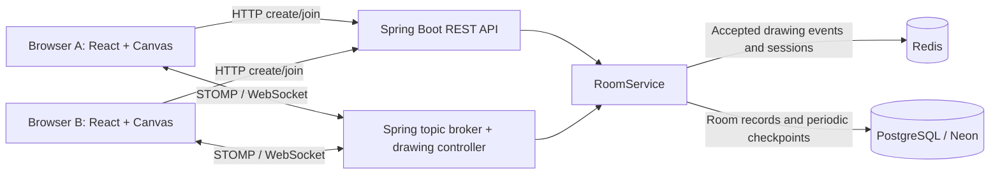

# SketchRoom

**Share a code. Draw together.**

A full-stack collaborative whiteboard for explaining ideas, sketching diagrams, and brainstorming together in the browser. Create a room, share its six-character code, and collaborate without signing up.

[Live demo](https://sketch-room-ashy.vercel.app/) · [Code walkthrough](docs/CODE_WALKTHROUGH.md) · [Deployment guide](docs/DEPLOYMENT.md)

## The problem

Remote discussions often need a shared visual space: a diagram to explain a system, a sketch to explore an idea, or a board to work through a problem. Sending screenshots interrupts that conversation and leaves participants looking at different versions.

SketchRoom gives participants a shared canvas with live drawing updates and saved room history. The engineering focus is keeping that shared state consistent when people join late, undo a stroke, clear the board, or reconnect after losing their connection.

## Try it

1. Open the demo and select **Create Room**.
2. Copy the room code and select **Enter Room**.
3. Open a second browser/tab, enter the code, and join.
4. Draw from either window, then try undo, redo, clear, and reload.

## Current features

- **Code-based rooms:** create or join a shared board using a six-character code; rooms expire after 24 hours.
- **Live collaboration:** drawing commands are broadcast to participants through STOMP over WebSocket.
- **Drawing tools:** eight colors, adjustable brush size, eraser, and shared clear.
- **Shared undo/redo:** undo or restore your current connection's strokes without replacing another participant's work with an old image.
- **Late-join replay:** new participants reconstruct the board from its saved event history.
- **Reconnect recovery:** reconnecting clients reload a snapshot and apply newer events before drawing is enabled.
- **Presence and connection status:** see participant counts and whether the board is connecting, loading, connected, or expired.
- **Pointer input:** mouse, pen, and touch use the same drawing handlers.
- **Validation:** the backend checks room expiry, session membership, drawing fields, and undo ownership.

## How it works



1. **Create or validate a room** through the REST API.
2. **Subscribe before loading history.** The server returns a private snapshot while the client buffers live updates.
3. **Draw locally and send commands.** A temporary canvas layer previews drawing immediately; accepted events become the shared canvas state.
4. **Order and store updates.** The server assigns sequence numbers, appends events to Redis, and broadcasts them to room subscribers.
5. **Checkpoint the board.** PostgreSQL receives JSON event snapshots every 30 seconds when a board changed, and on clear, last disconnect, or graceful shutdown.

A snapshot is a list of drawing instructions, not an image. Replaying those instructions rebuilds the board.

## Engineering decisions

| Decision | Reason and tradeoff |
|---|---|
| WebSocket + STOMP | Keeps a live connection and supplies named room destinations for updates, avoiding repeated HTTP polling. |
| Server sequence numbers | Clients detect missing updates and ignore events already included in a snapshot. |
| Redis + PostgreSQL checkpoints | Frequent events go to Redis; database writes are consolidated. Recent work still depends on Redis durability until checkpointed. |
| Stroke-based undo/redo | Stores commands instead of full-canvas pixel copies and synchronizes changes across participants. |
| One room lock for related operations | Serializes updates inside the backend process. Horizontal scaling would require distributed coordination. |
| Explicit history limit | Preserves existing work instead of silently trimming old strokes. At the limit, users can clear or create a new room. |

## Tech stack

| Layer | Technologies | Role |
|---|---|---|
| Frontend | React 18, TypeScript, Vite 6 | Components, typed event contracts, development and production builds. |
| Drawing | HTML Canvas 2D, Pointer Events | Rendering and mouse/pen/touch input. |
| UI | Tailwind CSS, Radix primitives, Lucide | Styling, reusable controls, icons, and notifications. |
| Backend | Java 17, Spring Boot 3.5.13 | REST endpoints, WebSocket handling, validation, and scheduled jobs. |
| Messaging | STOMP.js, Spring WebSocket simple broker | Client connections and room broadcasts. |
| Storage | Redis, PostgreSQL, Spring Data JPA | Event buffering, session tracking, room records, and checkpoints. |
| Build and testing | Maven, Docker, JUnit, Mockito, Vitest, Testing Library, Playwright | Packaging and automated verification. |
| Hosting | Vercel, Render, Neon | Frontend hosting, backend hosting, and managed PostgreSQL. A separate Redis service is also required. |

## Run locally

**Prerequisites:** Git, Java 17, Node.js 22, and Docker with Compose. Maven is supplied through the repository's wrapper.

### 1. Clone the repository

```sh
git clone https://github.com/suhanigupta23/SketchRoom.git
cd SketchRoom
```

### 2. Start storage and the backend

```sh
cd backend
docker compose up -d
./mvnw spring-boot:run
```

On Windows, use `mvnw.cmd spring-boot:run`.

Compose starts PostgreSQL 15 and Redis 7 with persistent volumes. Redis uses append-only persistence. The backend runs at `http://localhost:8080`.

### 3. Start the frontend

In a second terminal, from the repository root:

```sh
cd frontend
npm ci
npm run dev
```

Open **http://localhost:8081** in two browser windows to try collaboration. The frontend defaults to the local backend; no production credentials are needed for this setup.

## Configuration and deployment

The frontend is hosted on **Vercel**, the backend on **Render**, and PostgreSQL on **Neon**. Redis remains a separate backend dependency.

| Location | Setting | Purpose |
|---|---|---|
| Vercel | `VITE_BACKEND_URL` | Public HTTPS Render backend origin, supplied at build time. |
| Render | `SPRING_DATASOURCE_URL` | Neon PostgreSQL JDBC connection URL. |
| Render | `SPRING_DATASOURCE_USERNAME`, `SPRING_DATASOURCE_PASSWORD` | Database credentials. |
| Render | `REDIS_URL` | Hosted Redis URL; `rediss://` enables TLS. |
| Render | `REDIS_HOST`, `REDIS_PORT`, `REDIS_PASSWORD`, `REDIS_SSL` | Alternative to a Redis URL. |
| Render | `CORS_ORIGINS` | Comma-separated frontend origins allowed for HTTP and WebSocket connections. |
| Render | `WS_URL` | Optional public WebSocket URL. Leave unset to derive it from `VITE_BACKEND_URL`. |
| Render | `MAX_BOARD_EVENTS` | Event-history limit per room; default 50,000 commands. |

Use `frontend` as the Vercel root, `npm run build` as its build command, and `dist` as its output directory. Use `backend` as the Render Docker build context. The backend supports a platform-provided `PORT`.

`GET /api/rooms/health` checks liveness. `GET /api/rooms/ready` checks PostgreSQL and Redis connectivity.

Deploy protocol changes **backend first, then frontend**, and refresh existing browser tabs. Existing room columns are preserved; this update does not require a destructive schema migration. See the [deployment guide](docs/DEPLOYMENT.md) for compatibility and smoke tests.

## Tests and quality checks

```sh
# From frontend/
npm run lint
npm test
npm run build
npx playwright install chromium
npm run test:e2e
```

If Chrome is already installed, `PLAYWRIGHT_CHANNEL=chrome npm run test:e2e` can be used instead of downloading Chromium on macOS/Linux.

```sh
# From backend/
./mvnw verify
```

Coverage includes history beyond the old 2,000-event limit, clear/rejoin behavior, reconnect synchronization, duplicate events, ownership checks, expiry, storage failures, and concurrent event ordering. Browser tests exercise create/join, drawing across two tabs, shared undo/redo, clear, reload, and disabled drawing before synchronization.

The backend transport test uses real HTTP/WebSocket connections with mocked storage; browser tests use a simulated STOMP server. Production storage connectivity and capacity require separate deployment checks.

The GitHub Actions workflow runs frontend lint, tests, build, browser tests, and backend verification.

## Project structure

```text
SketchRoom/
├── frontend/
│   ├── src/pages/                 # Landing page and room orchestration
│   ├── src/components/            # Canvas, toolbar, and active UI primitives
│   ├── src/hooks/useWhiteboard.ts # Connection lifecycle and synchronization
│   ├── src/lib/                   # API requests and drawing-history helpers
│   ├── src/types/                 # Shared frontend event contracts
│   └── e2e/                       # Browser workflow tests
├── backend/
│   ├── src/main/java/com/sketchroom/
│   │   ├── controller/            # HTTP and STOMP handlers
│   │   ├── service/               # Room lifecycle, ordering, persistence
│   │   ├── model/                 # Room entity
│   │   ├── repository/            # PostgreSQL access
│   │   ├── dto/                   # Request, response, and event contracts
│   │   └── config/                # Redis, WebSocket, and CORS configuration
│   └── src/test/                  # Service, configuration, and transport tests
├── docs/                         # Code walkthrough and deployment instructions
└── .github/workflows/             # Automated verification
```

## Current boundaries

- One backend instance; Spring's simple broker and room locks are local to that process.
- Rooms are shared through their code, with no account-based access control.
- Undo ownership belongs to the current WebSocket session and resets on reconnect.
- The canvas is fixed at 3000 × 2000; drawing is disabled while disconnected or synchronizing.
- Redis/backend loss before a successful PostgreSQL checkpoint can lose recent work. Backups and Redis persistence remain important.
- The 50,000-command limit protects retained history; production-scale capacity has not been benchmarked.

## Future improvements

- User accounts, private rooms, and role-based access.
- Named boards that users can save and revisit.
- Text, shapes, image uploads, and PNG/PDF export.
- Participant cursors and collaborator identities.
- Zoom, pan, and a larger or infinite canvas.
- Undo ownership that survives reconnects through authenticated identities.
- Compact checkpoints and offline reconciliation for longer sessions.
- A shared external message broker and distributed coordination for multiple backend instances.
- Load testing, operational metrics, and alerts for storage or synchronization failures.

## Explore the implementation

For the exact function calls behind a button click or drawing action, read the [beginner-friendly code walkthrough](docs/CODE_WALKTHROUGH.md). It explains callbacks, refs, snapshots, toasts, rendering, and persistence using the actual source files.
